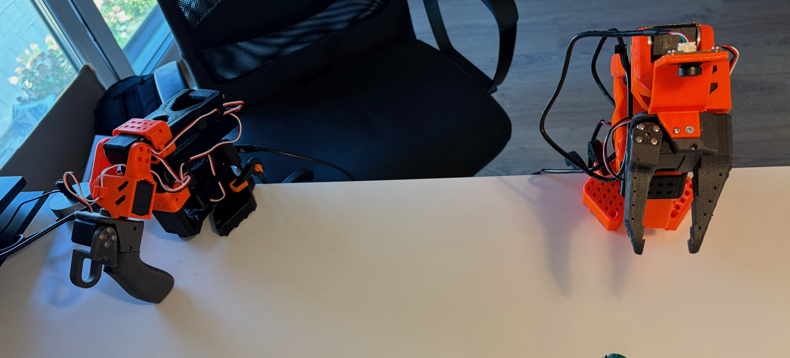
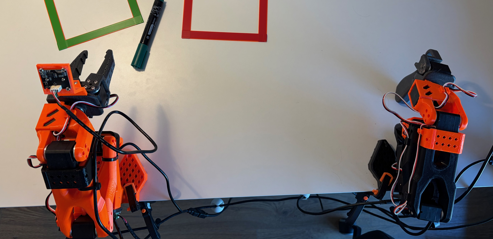

# Merry'n'Pippin Lab

Research repo for a small-budget robot-learning lab: hardware notes, datasets, training runs, and the experiments that don’t work.

Site: [merry-and-pippin.net](https://merry-and-pippin.net/)  
This repo: [github.com/filesmuggler/merry-n-pippin-lab](https://github.com/filesmuggler/merry-n-pippin-lab)

The public notebook lives on the site. This repo is where the lab work is done and documented next to the code. If a note is wrong or a setup is unclear, [open an issue](https://github.com/filesmuggler/merry-n-pippin-lab/issues).

The two arms on the bench are **Merry** (leader) and **Pippin** (follower). The names are a joke. They are also how the roles stay straight.

## What’s here

The starting plan is on the site: [Building a Low-Cost Robot Learning Lab](https://merry-and-pippin.net/posts/building-a-low-cost-robot-learning-lab/). This repo does not yet contain a finished cell, a public dataset, or a claimed baseline. Inventing those would make the notebook useless.

| Path | Role |
| --- | --- |
| [`docs/`](docs/) | Lab notes that stay next to the code |
| [`experiments/`](experiments/) | Code with experiments and training |
| [`hardware/`](hardware/) | BOM and related hardware topics |
| [`LICENSE`](LICENSE) | Apache 2.0 |

Code, configs, and run artifacts land here when they exist. Until then, treat commands in these docs as scaffolding.

## Hardware

Low-cost manipulator class (SO-101-style), RGB cameras that can be moved and broken, one workstation. Nothing below is a completed bill of materials.

| Piece | Role |
| --- | --- |
| Merry | Leader arm — plans and leads the motion |
| Pippin | Follower arm — same scene, more likely to do something inadvisable |
| RGB camera(s) | Observation for VLA policies |
| Workstation GPU | Training and inference on a single consumer card |
| Desk + mounts | Repeatable scenes |

Details: [hardware/hardware.md](hardware/hardware.md).

## Experiments

All experiments and code for training. I am exploring different topics so it is real work-in-progress code. Always cooking!

## License

Apache License 2.0. See [LICENSE](LICENSE).

